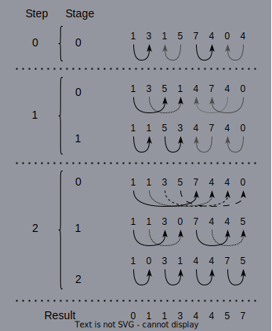

# Applications Bitonic Sort Example

## Description

This example showcases a GPU implementation of the [bitonic sort](https://en.wikipedia.org/wiki/Bitonic_sorter) and uses it to order increasingly (or decreasingly) an array of $n$ elements. Another implementation of the said algorithm exists in rocPRIM and could be used instead. Also, rocPRIM's algorithm would likely offer an improved performance.

A sequence $\{x_n\}_{n=1}^m$ is called bitonic if it possesses one of the following two properties:

1. There exists an index $k$ such that $x_0 \leq x_1 \leq \cdots \leq x_k$ and $x_k \geq x_{k+1} \geq \cdots x_{m-1}$ i.e. $\{x_n\}$ is monotonically increasing before $x_k$ and monotonically decreasing after.
2. There exists a permutation $\sigma \in S_m$ of the indices such that $\{x_{\sigma(n)}\}_{n=1}^m$ satisfies the above property.

Each step $i$ of this bitonic sort implementation yields bitonic subsequences of length $2^{i+2}$, each of them having two monotonically ordered subsequences of length $2^{i+1}$. The idea is to use this bitonic sort for as many steps as necessary to obtain a bitonic sequence of length $2n$, because then our $n$-length array will be monotonically (increasingly or decreasingly) sorted. That is, we need to iterate for a total of $\log_2(n) - 1$ steps. Notice that this also implies that the array to be sorted must have a length equal to a power of two.

Below is presented an example of how an array of length 8 would be ordered increasingly. An arrow from one element to other means that those two elements are compared in the stage and step indicated in the left columns. The resulting order will be such that the lesser element will be placed at the position from which the arrow starts and the greater element will be placed at the position pointed by the end of the arrow. For an easier understanding, black arrows correspond to an increasing order and grey arrows to a decreasing order of the elements.

### Application flow

1. Parse user input.
2. Allocate and initialize host input array and make a copy for the CPU comparison.
3. Define a number of constants for kernel execution.
4. Declare device array and copy input data from host to device.
5. Enqueue calls to the bitonic sort kernel for each step and stage.
6. Copy back to the host the resulting ordered array and free events variables and device memory.
7. Report execution time of the kernels.
8. Compare the array obtained with the CPU implementation of the bitonic sort and print to standard output the result.

### Command line interface

There are three options available:

- `-h` displays information about the available parameters and their default values.
- `-l <length>` sets `length` as the number of elements of the array that will be sorted. It must be a power of $2$. Its default value is $2^{15}$.
- `-s <sort>` sets `sort` as the type or sorting that we want our array to have: decreasing ("dec") or increasing ("inc"). The default value is "inc".

## Key APIs and Concepts

- Device memory is allocated with `hipMalloc` and deallocated with `hipFree`.

- With `hipMemcpy` data bytes can be transferred from host to device (using `hipMemcpyHostToDevice`) or from device to host (using `hipMemcpyDeviceToHost`).

- `hipEventCreate` creates events, which are used in this example to measure the kernels execution time. `hipEventRecord` starts recording an event, `hipEventSynchronize` waits for all the previous work in the stream when the specified event was recorded. With these three functions it can be measured the start and stop times of the kernel and with `hipEventElapsedTime` it can be obtained the kernel execution time in milliseconds. Lastly, `hipEventDestroy` destroys an event.

- `myKernelName<<<...>>>` queues kernel execution on the device. All the kernels are launched on the `hipStreamDefault`, meaning that these executions are performed in order. `hipGetLastError` returns the last error produced by any runtime API call, allowing to check if any kernel launch resulted in error.

## Demonstrated API Calls

### HIP runtime

#### Device symbols

- `blockDim`
- `blockIdx`
- `threadIdx`

#### Host symbols

- `__global__`
- `hipEvent_t`
- `hipEventCreate`
- `hipEventDestroy`
- `hipEventElapsedTime`
- `hipEventRecord`
- `hipEventSynchronize`
- `hipFree`
- `hipGetLastError`
- `hipMalloc`
- `hipMemcpy`
- `hipMemcpyDeviceToHost`
- `hipMemcpyHostToDevice`
- `hipStreamDefault`
