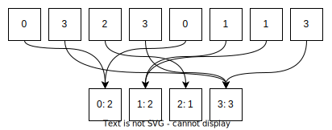
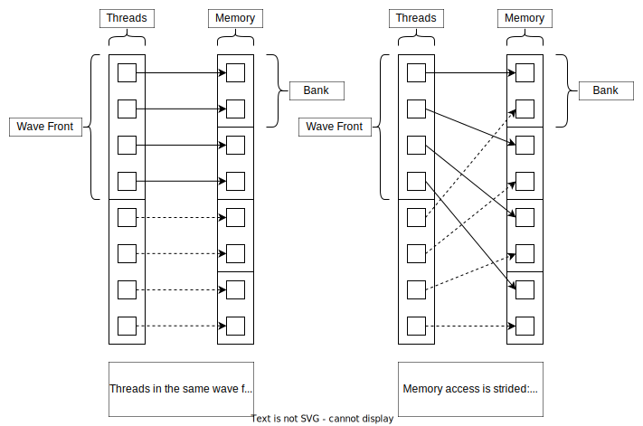

# Applications: Histogram Example

## Description

This program showcases a GPU kernel and its invocation of a histogram computation over a byte (`unsigned char`) array. A histogram constructs a table with the counts of each discrete value.
The diagram below showcases a 4 bin histogram over an 8-element long array:

The kernel is optimized to reduce bank conflicts.
On GPUs memory is divided into banks and each bank may be accessed in parallel.
When the same bank is accessed twice concurrently, the memory accesses will be executed serially which lowers data throughput.
Since this kernel uses a shared memory with less than 4-byte long elements (`unsigned char`, 1-byte long) bank conflicts can occur.
This is solved by striding over the input such a way that each thread accesses a different memory bank. See the diagram below:

### Application flow

1. Define and allocate inputs and outputs on host.
2. Allocate the memory on device and copy the input.
3. Launch the histogram kernel.
4. Copy the results back to host and calculate the final histogram.
5. Free the allocated memory on device.
6. Verify the results on host.

### Key APIs and concepts

- _Bank conflicts._ Memory is stored across multiple banks. Elements in banks are stored in 4-byte words. Each thread within a wavefront should access different banks to ensure high throughput.
- `__ffs(int input)` finds the 1-index of the first set least significant bit of the input.
- `__syncthreads()` halts this thread until all threads within the same block have reached this point.
- `__shared__` marks memory as shared. All threads within the same block can access this.

## Demonstrated API calls

### HIP runtime

#### Device symbols

- `blockDim`
- `blockIdx`
- `threadIdx`
- `__ffs()`
- `__syncthreads()`
- `__shared__`

#### Host symbols

- `__global__`
- `hipEvent_t`
- `hipEventCreate`
- `hipEventDestroy`
- `hipEventElapsedTime`
- `hipEventRecord`
- `hipEventSynchronize`
- `hipFree()`
- `hipGetLastError`
- `hipMalloc()`
- `hipMemcpy()`
- `hipMemcpyHostToDevice`
- `hipMemcpyDeviceToHost`
- `myKernel<<<...>>>()`
