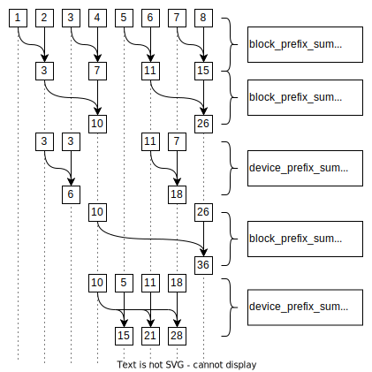

# Applications: Prefix Sum Example

## Description

This example showcases a GPU implementation of a prefix sum via a scan algorithm.
This example does not use the scan or reduce methods from rocPRIM or hipCUB (`hipcub::DeviceScan::ExclusiveScan`) which could provide improved performance.

For each element in the input, prefix sum calculates the sum from the beginning up until the item:

$a_n = \sum^{n}_{m=0} A[m]$

The algorithm used has two phases which are repeated:

  a) the block wide prefix sum which uses a two pass prefix sum algorithm as described in _Prefix Sums and Their Applications_ (Blelloch, 1988).

  b) the device wide prefix sum which propagates values from one block to others.

Below is an example where the threads per block is 2.
In the first iteration ($\text{offset}=1$) we have 4 threads combining 8 items.

### Application flow

1. Parse user input.
2. Generate input vector.
3. Calculate the prefix sum.

    a) Define the kernel constants.

    b) Declare and allocate device memory.

    c) Copy the input from host to device

    d) Sweep over the input, multiple times if needed.

    e) Copy the results from device to host.

    f) Clean up device memory allocations.

4. Verify the output.

### Command line interface

The application has an optional argument:

- `-n <n>` with size of the array to run the prefix sum over. The default value is `256`.

### Key APIs and concepts

- Device memory is managed with `hipMalloc` and `hipFree`. The former sets the pointer to the allocated space and the latter frees this space.

- `myKernel<<<...>>>()` launches the kernel named `myKernel`.
  In this example the kernels `block_prefix_sum` and `device_prefix_sum` are launched.
  `block_prefix_sum` requires shared memory which is passed along in the kernel launch.

- `extern __shared__ float[]` in the kernel code denotes an array in shared memory which can be accessed by all threads in the same block.

- `__syncthreads()` blocks this thread until all threads within the current block have reached this point.
  This is to ensure no unwanted read-after-write, write-after-write, or write-after-read situations occur.

## Demonstrated API calls

### HIP runtime

#### Device symbols

- `blockDim`
- `blockIdx`
- `threadIdx`
- `__syncthreads()`
- `__shared__`

#### Host symbols

- `__global__`
- `hipFree()`
- `hipMalloc()`
- `hipMemcpy()`
- `hipMemcpyHostToDevice`
- `hipMemcpyDeviceToHost`
- `myKernel<<<...>>>()`
