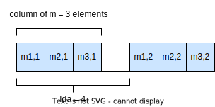

# rocBLAS Level 2 Hermitian Rank-1 Update Example

## Description

This example showcases the usage of the rocBLAS Level2 Hermitian rank-1 update functionality. Additionally, this example demonstrates the compatible memory layout of three different complex float types (`hipFloatComplex`, `std::complex<float>`, and `rocblas_float_complex`). Vectors of complex numbers can be passed to rocBLAS simply by performing a call to `hipMemcpy` and reinterpreting the respective pointers.

### Application flow

1. Read in command-line parameters.
2. Allocate and initialize the host vector and matrix.
3. Compute CPU reference result.
4. Create a rocBLAS handle.
5. Allocate and initialize the device vector and matrix.
6. Invoke the rocBLAS HER function.
7. Copy the result from device to host.
8. Destroy the rocBLAS handle, release device memory.
9. Validate the output by comparing it to the CPU reference result.

### Command line interface

The application provides the following optional command line arguments:

- `-a` or `--alpha`. The scalar value $\alpha$ used in the HER operation. Its default value is 1.
- `-x` or `--incx`. The stride between consecutive values in the data array that makes up vector $x$, which must be greater than 0. Its default value is 1.
- `-n` or `--n`. The number of elements in vectors $x$ and $y$, which must be greater than 0. Its default value is 5.

## Key APIs and Concepts

- rocBLAS is initialized by calling `rocblas_create_handle(rocblas_handle*)` and it is terminated by calling `rocblas_destroy_handle(rocblas_handle)`.

- The _pointer mode_ controls whether scalar parameters must be allocated on the host (`rocblas_pointer_mode_host`) or on the device (`rocblas_pointer_mode_device`). It is controlled by `rocblas_set_pointer_mode`.

- `rocblas_[cz]her(handle, uplo, n, *alpha, *x, incx, *A, lda)` computes a Hermitian rank-1 update, defined as $A = A + \alpha \cdot x \cdot x ^ H$, where $A$ is an $n \times n$ Hermitian matrix, and $x$ is a complex vector of $n$ elements. The character matched in `[cz]` denotes the data type of the operation, and can either be `c` (complex float: `rocblas_complex_float`), or `z` (complex double: `rocblas_complex_double`). Because a Hermitian matrix is symmetric over the diagonal, except that the values in the upper triangle are the complex conjugate of the values in the lower triangle, the required work is reduced by only updating a single half of the matrix. The part of the matrix to update is given by `uplo`: `rocblas_fill_upper` indicates that the upper triangle of $A$ should be updated, and `rocblas_fill_lower` indicates that the lower triangle should be updated. Values in the other triangle are not altered. `n` gives the dimensions of $x$ and $A$, and `incx` the increment in elements between items of $x$. `lda` is the _leading dimension_ of $A$: the number of elements between the starts of columns of $A$. The elements of each column of $A$ are packed in memory. Note that rocBLAS matrices are laid out in _column major_ ordering. See the following figure, which illustrates the memory layout of a matrix with 3 rows and 2 columns: 

    

- `hipFloatComplex`, `std::complex<float>`, and `rocblas_float_complex` have compatible memory layout, and performing a memory copy between values of these types will correctly perform the expected copy.

- `hipCaddf(a, b)` adds `hipFloatComplex` values `a` and `b` element-wise together. This function is from a family of host/device HIP functions which operate on complex values.

## Demonstrated API Calls

### rocBLAS

- `rocblas_cher`
- `rocblas_create_handle`
- `rocblas_destroy_handle`
- `rocblas_fill`
- `rocblas_fill_lower`
- `rocblas_fill_upper`
- `rocblas_float`
- `rocblas_float_complex`
- `rocblas_handle`
- `rocblas_int`
- `rocblas_pointer_mode_host`
- `rocblas_set_pointer_mode`
- `rocblas_status`
- `rocblas_status_success`
- `rocblas_status_to_string`

### HIP runtime

- `hipCaddf`
- `hipFloatComplex`
- `hipFree`
- `hipMalloc`
- `hipMemcpy`
- `hipMemcpyDeviceToHost`
- `hipMemcpyHostToDevice`
