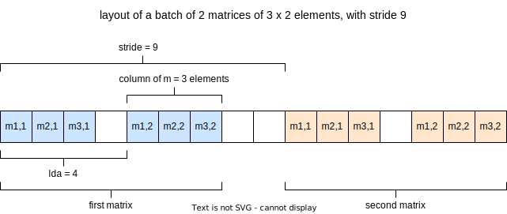

# rocBLAS Level 3 Generalized Matrix Multiplication Strided Batched Example

## Description

This example illustrates the use of the rocBLAS Level 3 Strided Batched General Matrix Multiplication. The rocBLAS GEMM STRIDED BATCHED performs a matrix--matrix operation for a _batch_ of matrices as:

$C[i] = \alpha \cdot op_a(A[i]) \cdot op_b(B[i]) + \beta \cdot (C[i])$

for each $i \in [0, batch - 1]$, where $X[i] = X + i \cdot strideX$ is the $i$-th element of the correspondent batch and $op_m(M)$ is one of the following:

- $op_m(M) = M$ or
- $op_m(M) = M^T$ (transpose $M$: $M_{ij}^T = M_{ji}$) or
- $op_m(M) = M^H$ (Hermitian $M$: $M_{ij}^H = \bar M_{ji} $).
In this example the identity is used.

$\alpha$ and $\beta$ are scalars, and $A$, $B$ and $C$ are the batches of matrices. For each $i$, $A[i]$, $B[i]$ and $C[i]$ are matrices such that
$op_a(A[i])$ is an $m \times k$ matrix, $op_b(B[i])$ a $k \times n$ matrix and $C_i$ an $m \times n$ matrix.

### Application flow

1. Read in command-line parameters.
2. Set dimension variables of the matrices and get batch count and stride.
3. Allocate and initialize the host matrices. Set up $B$ matrix as an identity matrix.
4. Initialize gold standard matrix.
5. Compute CPU reference result with strided batched subvectors.
6. Allocate device memory.
7. Copy data from host to device.
8. Create a rocBLAS handle.
9. Invoke the rocBLAS GEMM STRIDED BATCHED function.
10. Copy the result from device to host.
11. Destroy the rocBLAS handle, release device memory.
12. Validate the output by comparing it to the CPU reference result.

### Command line interface

The application provides the following optional command line arguments:

- `-a` or `--alpha`. The scalar value $\alpha$ used in the GEMM operation. Its default value is 1.
- `-b` or `--beta`. The scalar value $\beta$ used in the GEMM operation. Its default value is 1.
- `-c` or `--count`. Batch count. Its default value is 3.
- `-m` or `--m`. The number of rows of matrices $A_i$ and $C_i$, which must be greater than 0. Its default value is 5.
- `-n` or `--n`. The number of columns of matrices $B_i$ and $C_i$, which must be greater than 0. Its default value is 5.
- `-k` or `--k`. The number of columns of columns of matrix $A_i$ and rows of $B_i$

## Key APIs and Concepts

- The performance of a numerical multi-linear algebra code can be heavily increased by using tensor contractions [ [Y. Shi et al., HiPC, pp 193, 2016.](https://doi.org/10.1109/HiPC.2016.031) ], thereby most of the rocBLAS functions have a`_batched` and a `_strided_batched` [ [C. Jhurani and P. Mullowney, JPDP Vol 75, pp 133, 2015.](https://doi.org/10.1016/j.jpdc.2014.09.003) ] extensions. 

    We can apply the same multiplication operator for several matrices if we combine them into batched matrices. Batched matrix multiplication has a performance improvement for a large number of small matrices. For a constant stride between matrices, further acceleration is available by strided batched GEMM.

- rocBLAS is initialized by calling `rocblas_create_handle(rocblas_handle*)` and it is terminated by calling `rocblas_destroy_handle(rocblas_handle)`.

- The _pointer mode_ controls whether scalar parameters must be allocated on the host (`rocblas_pointer_mode_host`) or on the device (`rocblas_pointer_mode_device`). It is controlled by `rocblas_set_pointer_mode`.

- `rocblas_stride` strides between matrices or vectors in strided_batched functions.

- `rocblas_[sdhcz]gemm_strided_batched`

  Depending on the character matched in `[sdhcz]`, the norm can be obtained with different precisions:

  - `s` (single-precision: `rocblas_float`)
  - `d` (double-precision: `rocblas_double`)
  - `h` (half-precision: `rocblas_half`)
  - `c` (single-precision complex: `rocblas_complex`)
  - `z` (double-precision complex: `rocblas_double_complex`).

  Input parameters:

  - `rocblas_handle handle`
  - `rocblas_operation transA`: transformation operator on $A_i$ matrix
  - `rocblas_operation transB`: transformation operator on $B_i$ matrix
  - `rocblas_int m`: number of rows in $A_i'$ and $C_i$ matrices
  - `rocblas_int n`: number of columns in $B_i'$ and $C_i$ matrices
  - `rocblas_int k`: number of columns in $A_i'$ matrix and number of rows in $B_i'$ matrix
  - `const float *alpha`: scalar multiplier of $C_i$ matrix addition
  - `const float *A`: pointer to each $A_i$ matrix
  - `rocblas_int lda`: leading dimension of each $A_i$ matrix
  - `rocblas_stride stride_a`: stride size for each $A_i$ matrix
  - `const float *B`: pointer to each  $B_i$ matrix
  - `rocblas_int ldb`: leading dimension of each  $B_i$ matrix
  - `const float *beta`: scalar multiplier of the $B \cdot C$ matrix product
  - `rocblas_stride stride_b`: stride size for each $B_i$ matrix
  - `float *C`: pointer to each  $C_i$ matrix
  - `rocblas_int ldc`: leading dimension of each $C_i$ matrix
  - `rocblas_stride stride_c`: stride size for each $C_i$ matrix
  - `rocblas_int batch_count`: number of matrices

  Return value: `rocblas_status`

## Demonstrated API Calls

### rocBLAS

- `rocblas_int`
- `rocblas_float`
- `rocblas_operation`
- `rocblas_operation_none`
- `rocblas_handle`
- `rocblas_create_handle`
- `rocblas_destroy_handle`
- `rocblas_set_pointer_mode`
- `rocblas_pointer_mode_host`
- `rocblas_stride`
- `rocblas_sgemm_strided_batched`

### HIP runtime

- `hipMalloc`
- `hipFree`
- `hipMemcpy`
- `hipMemcpyHostToDevice`
- `hipMemcpyDeviceToHost`
