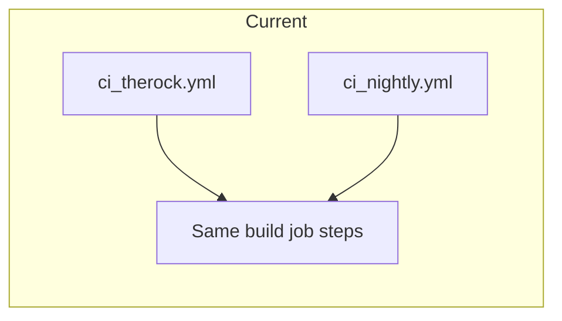
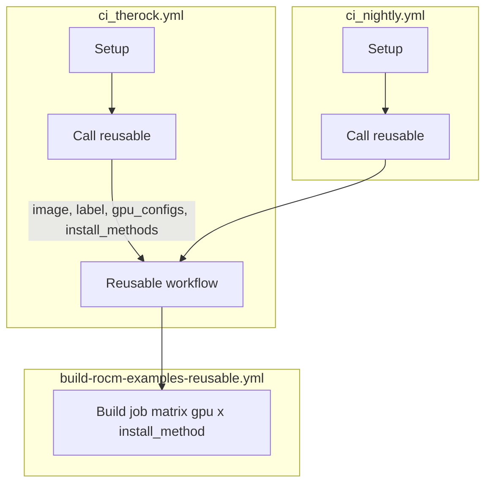

# Scalable CI for multiple distros

## Current state

[ci_therock.yml](.github/workflows/ci_therock.yml) and [ci_nightly.yml](.github/workflows/ci_nightly.yml) are almost identical (~250 lines each). The only differences are:

- **Triggers**: TheRock = push/PR on code paths; Nightly = cron + PR on `.github` only.
- **Job name**: "TheRock - ..." vs "SLES 15.7 - ...".
- **Container image**: `rocm-examples-ubuntu-22.04` vs `rocm-examples-sles-15.7`.
- **Wheel sanity check**: Nightly has `continue-on-error: true`; TheRock does not.
- **CMake**: TheRock uses `"${ROCM_PATH}"`; Nightly uses `$ROCM_PATH` (minor).

All other steps (checkout, install wheel/tarball, env, CMake configure/build, summaries, ctest with skip file, clean) are duplicated.




---

## Approach: Reusable workflow + thin callers

Use a **reusable workflow** that holds a single “build” job (matrix over `gpu_config` x `install_method`). Each caller workflow triggers that reusable workflow once per distro with the right inputs. Adding a new distro = add one more call or one more matrix entry.




---

## 1. Add reusable workflow

**New file:** [.github/workflows/build-rocm-examples-reusable.yml](.github/workflows/build-rocm-examples-reusable.yml)

- **Trigger:** `workflow_call` with inputs:
  - `distro_image` (string, required) – e.g. `ghcr.io/rocm/rocm-examples-ubuntu-22.04:latest`
  - `distro_label` (string, required) – for job name, e.g. `"Ubuntu 22.04"`
  - `distro_key` (string, optional) – for skip-file / script, e.g. `ubuntu-22.04` or `sles-15.7`
  - `gpu_configs` (string, required) – JSON array from setup
  - `install_methods` (string, required) – JSON array from setup
- **Wheel sanity check step:** Always use `continue-on-error: true` (no input; not configurable).
- **Single job** (e.g. `build`):
  - `runs-on`, `container.image`, and job name use `distro_image` / `distro_label`.
  - `strategy.matrix`: `gpu_config: ${{ fromJson(inputs.gpu_configs) }}`, `install_method: ${{ fromJson(inputs.install_methods) }}`.
  - **Steps:** Move the entire current build-job body here (checkout, install wheel/tarball, env, CMake configure, configure summary, build, upload artifact, run tests with skip file, test summary, clean). No logic change; only replace hardcoded image and any job-name literal with the inputs.
- **Skip tests:** Use `distro_key` when present for per-distro skips (e.g. call `get_skip_tests.py` with `--distro "${{ inputs.distro_key }}"` and `-o skip_tests.txt`, or resolve a skip file name from `distro_key` + `gpu_target` if you keep file-based skips). If `distro_key` is empty, keep current behavior (e.g. skip file by gpu_target only).
- **Artifact name:** Include `inputs.distro_label` (or `distro_key`) so artifacts from different distros do not collide, e.g. `rocm-examples-build-${{ inputs.distro_key }}-${{ matrix.gpu_config.gpu_target }}-...`.

---

## 2. Config-driven distros in configure_ci.py (adopted)

Extend [configure_ci.py](.github/build_tools/configure_ci.py) to define and output a `distros` JSON array. Setup job will write `distros` to `GITHUB_OUTPUT` alongside `gpu_configs` and `install_methods`.

- Add a **DISTROS** list (e.g. at top of script) with one dict per distro: `key`, `image`, `label`. No `sanity_check_continue_on_error` (sanity check is always continue-on-error in the reusable).
- Example:

```python
DISTROS = [
    {"key": "ubuntu-22.04", "image": "ghcr.io/rocm/rocm-examples-ubuntu-22.04:latest", "label": "Ubuntu 22.04"},
    {"key": "sles-15.7", "image": "ghcr.io/rocm/rocm-examples-sles-15.7:latest", "label": "SLES 15.7"},
]
```

- In `main()`, write `distros` to `GITHUB_OUTPUT`: `f"distros={json.dumps(DISTROS)}\n"`. Adding a new distro = append one entry to `DISTROS` and ensure the container image exists.

---

## 3. Caller workflows: distro matrix + reusable

Both **ci_therock.yml** and **ci_nightly.yml** use the same pattern: setup outputs `gpu_configs`, `install_methods`, and `distros`; then a single job uses a **matrix** over `distro: ${{ fromJson(needs.setup.outputs.distros) }}` and **calls** the reusable workflow once per distro.

**ci_therock.yml** – Keep **on:** push, pull_request, workflow_dispatch (and paths) unchanged. **Setup** job: run configure_ci.py; outputs gpu_configs, install_methods, distros. **Replace** the current build job with a job that has matrix: distro: fromJson(needs.setup.outputs.distros) and a step that calls the reusable workflow with distro_image, distro_label, distro_key, gpu_configs, install_methods from matrix.distro and needs.setup.outputs. Job name can include matrix.distro.label.

**ci_nightly.yml** – Same structure; keep its triggers, same setup, same matrix-over-distros job. No sanity_check_continue_on_error; the reusable always uses continue-on-error: true on the sanity check step.

**Adding more distros:** Edit only configure_ci.py and add one dict to DISTROS. No workflow YAML changes needed.

---

## 4. Skip tests and distro_key

- Reusable workflow receives `distro_key` (e.g. `ubuntu-22.04`, `sles-15.7`).
- In “Run tests”:
  - If you use a Python script: run `get_skip_tests.py "${{ matrix.gpu_config.gpu_target }}" --distro "${{ inputs.distro_key }}" -o skip_tests.txt` so per-ASIC and per-distro skips are combined.
  - If you use only static files: support a naming convention like `skip_tests_<gpu_target>_<distro_key>.txt` and fall back to `skip_tests_<gpu_target>.txt` when the combined file is missing.

---

## Summary


| Item                  | Action                                                                                                                                                                                                                              |
| --------------------- | ----------------------------------------------------------------------------------------------------------------------------------------------------------------------------------------------------------------------------------- |
| New reusable workflow | Add `build-rocm-examples-reusable.yml` with `workflow_call`, inputs for distro (image, label, key) and config (gpu_configs, install_methods). Wheel sanity check step always uses `continue-on-error: true`. No sanity_check input. |
| configure_ci.py       | Add `DISTROS` list (key, image, label) and output `distros` to `GITHUB_OUTPUT`.                                                                                                                                                     |
| ci_therock.yml        | Setup outputs distros; replace build job with matrix over `fromJson(needs.setup.outputs.distros)` and one `workflow_call` per distro.                                                                                               |
| ci_nightly.yml        | Same as ci_therock: setup outputs distros; matrix over distros, one `workflow_call` per distro.                                                                                                                                     |
| Skip tests            | Use `distro_key` in reusable for distro-aware skip list (script or file naming).                                                                                                                                                    |
| More distros          | Add one entry to `DISTROS` in configure_ci.py only.                                                                                                                                                                                 |


This removes duplication and keeps adding distros to a single place (DISTROS in configure_ci.py).